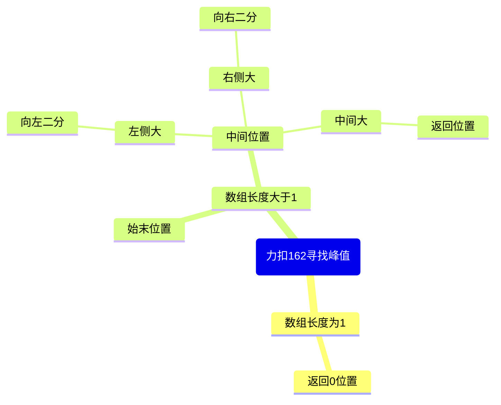

保证数组有序才能用

```java
//找>=num的最左位置
public static int findLeft(int[] arr, int num){
    int l = 0, r = arr.length-1, m = 0;
    int ans = -1;
    while(l <= r){
        m = l+ (r-l) >> 1;//避免假溢出
        if(arr[m] >= num){
            ans = m;
            r = m-1;
        }else{
            l = m+1;
        }
    }
    return ans;
}

//无序数组找峰值，默认数组外最左最右无穷小，且相邻不相等
public static int findPeakElement(int[] arr){
    int n = arr.length;
    if(n == 1) return 0;
    //1.单独确认最左最右位置
    if(arr[0] > arr[1]) return 0;
    if(arr[n-1] > arr[n-2]) return n-1;
    //2.二分循环
    int l = 1, r = n-2, m = 0, ans = -1;
    while(l <= r){
        //m = l + (r-l)>>1;
        m = l + (r-l>>1);//加减比位运算符优先级高
        //如果靠左位置比中点大，那么峰值在左边
        if(arr[m-1] > arr[m]){
            r = m-1;
            //m = l + (r-l)>>1;大循环里已更新
        }//如果靠右位置比中点大，那么峰值在右边
        else if(arr[m+1] > arr[m]){
            l = m+1;
        }//中间是峰值
        else{
            ans = m;
            break;
        }
    }
    return ans;
}
```



